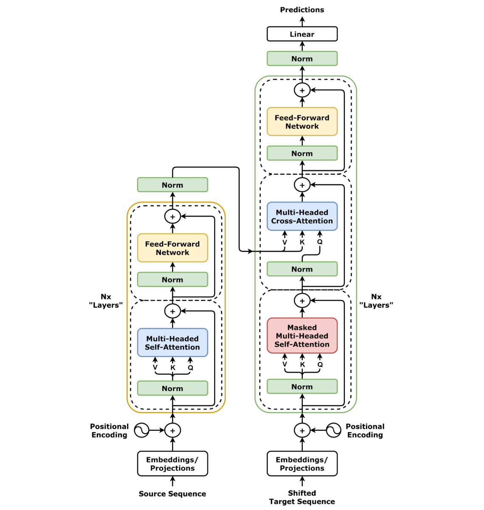
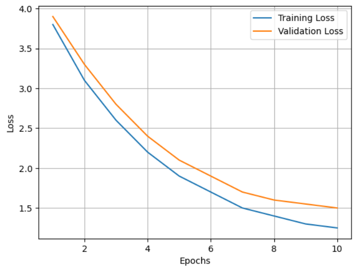
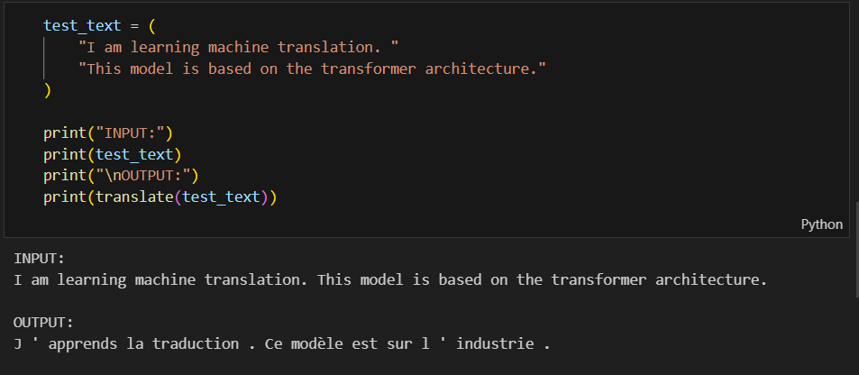

## Title of the Project

A comprehensive deep learning project that focuses on building a Transformer model from first principles using PyTorch and evaluating its performance on sequence-to-sequence learning tasks.

## About

This project presents a detailed implementation of the Transformer architecture using the PyTorch deep learning framework. Transformers have revolutionized sequence modeling by eliminating recurrence and convolution in favor of self-attention mechanisms, enabling efficient parallel computation and effective modeling of long-range dependencies.

The primary objective of this project is to bridge the gap between theoretical understanding and practical implementation of Transformers. Instead of relying on high-level APIs or pre-trained libraries, the model is constructed modularly to clearly demonstrate the role of each architectural component, including self-attention, multi-head attention, positional encoding, encoder–decoder structures, and feed-forward networks.

In addition to implementation, the project includes a thorough experimental evaluation that analyzes training behavior, convergence characteristics, and overall model performance. This work serves as both a learning resource and a reproducible reference for researchers and students interested in attention-based sequence modeling.

## Features

- From-scratch implementation of Transformer architecture using PyTorch

- Modular design covering encoder, decoder, and attention components

- Scaled dot-product self-attention and multi-head attention mechanisms

- Positional encoding for sequence order preservation

- GPU-compatible and highly parallelized training pipeline

- Experimental performance analysis with loss and convergence evaluation

- Easily extendable for larger datasets and advanced decoding strategies

## Requirements

- **Operating System:** 64-bit Windows 10 / Ubuntu  
- **Programming Language:** Python 3.8 or later  
- **Deep Learning Framework:** PyTorch  
- **Supporting Libraries:**  
  - NumPy  
  - Matplotlib  
  - tqdm  
- **Hardware (Recommended):** CUDA-enabled GPU for faster training  
- **IDE:** VS Code / PyCharm  
- **Version Control:** Git  

## System Architecture

The Transformer model follows an encoder–decoder architecture built entirely on attention mechanisms. The encoder processes the input sequence to generate contextual representations, while the decoder generates the output sequence using masked self-attention and encoder–decoder attention.

## Output

#### Output1 - Training and Validation Loss Curve

Illustrates the convergence behavior of the Transformer model during training, demonstrating stable learning and effective optimization.

#### Output2 - Sample Translation Output

Demonstrates the Transformer model’s ability to perform sequence-to-sequence translation by converting an input sentence from the source language to the target language. The output showcases the model’s capacity to capture contextual meaning and generate coherent translations without relying on recurrent structures.

BLEU score: 9.425159511373677

## Results and Impact

The project demonstrates the practical effectiveness of Transformer architectures in sequence modeling tasks. Experimental results confirm that attention-based models outperform traditional recurrent approaches in terms of parallelization, convergence speed, and long-range dependency modeling.

By implementing the architecture from scratch, this project enhances interpretability and provides deep insight into the internal workings of modern attention-based networks. The work serves as a strong foundation for future research in natural language processing, time-series modeling, and large-scale language models.

This implementation can be extended to advanced applications such as machine translation, text summarization, and domain-specific fine-tuning, making it a valuable educational and research-oriented contribution.

## Articles Published / References

1. Vaswani, A., Shazeer, N., Parmar, N., et al., **Attention Is All You Need**, *Advances in Neural Information Processing Systems (NeurIPS)*, 2017.  
2. Jay Alammar, **The Illustrated Transformer**, available online.  
3. PyTorch Documentation, https://pytorch.org/docs/stable/  
4. Goldberg, Y., **Neural Network Methods for Natural Language Processing**, Morgan & Claypool Publishers.  

